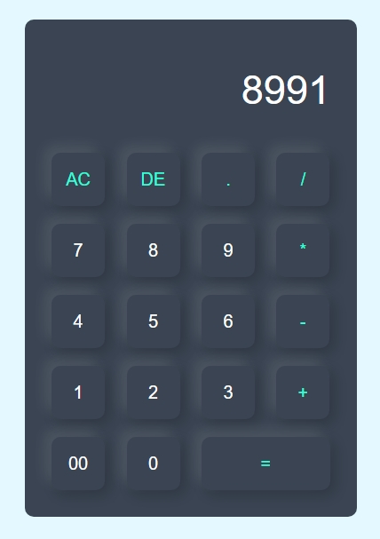

# 🧮 Calculator App

Welcome to the **Calculator App**! This project is a simple, beautiful calculator built with HTML and CSS.

## 🖼️ Screenshot



## 🚀 Demo

Check out the live demo here: [Calculator App](gupta-ravi.github.io/JsCalculatorApp/)

## 🎥 Tutorial Video

Watch the tutorial video here: [YouTube Tutorial](https://youtu.be/cGgLHJGyS34)

## 📋 Features

- **Basic Arithmetic Operations:** Addition, subtraction, multiplication, and division.
- **Clear and Delete:** Quickly clear all entries or delete the last entry.
- **Responsive Design:** Works beautifully on both desktop and mobile devices.

## 🛠️ Installation

1. Clone the repository: 

```bash
git clone https://github.com/your-github-username/JsWeatherApp.git
```

2. Open the `index.html` file in your web browser.

## 📂 Project Structure

```bash
calculator-app/
├── index.html
├── style.css
└── README.md
```

## 🤝 Contributing

Contributions, issues, and feature requests are welcome! Feel free to check the [issues page](https://github.com/yourusername/calculator-app/issues) if you want to contribute.

1. Fork the project
2. Create your feature branch (`git checkout -b feature/awesome-feature`)
3. Commit your changes (`git commit -m 'Add some awesome feature'`)
4. Push to the branch (`git push origin feature/awesome-feature`)
5. Open a pull request


## 📝 License

This project is licensed under the MIT License - see the [LICENSE](LICENSE) file for details.

## 🙏 Acknowledgments

- Thanks to all the contributors and users of this project.
